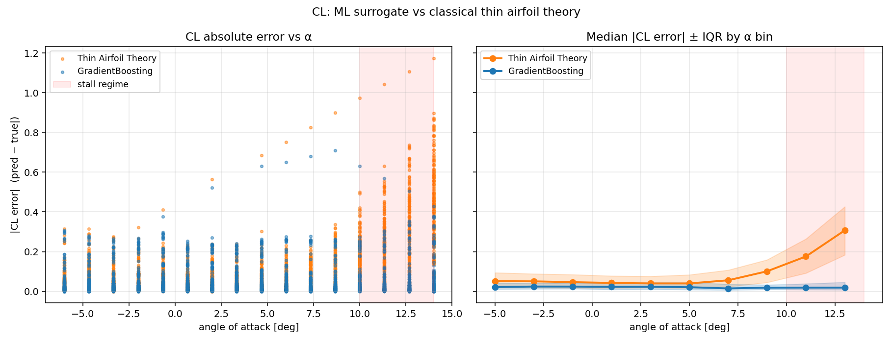
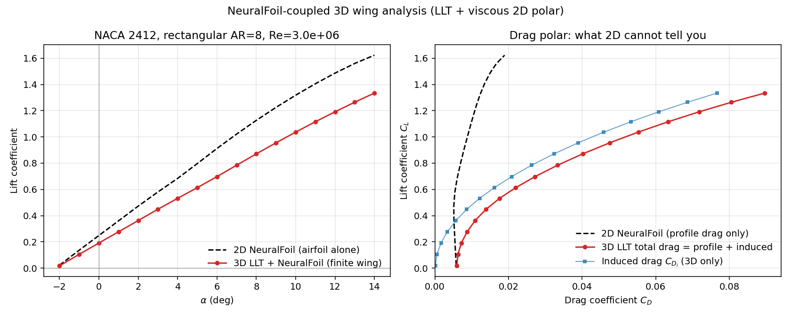
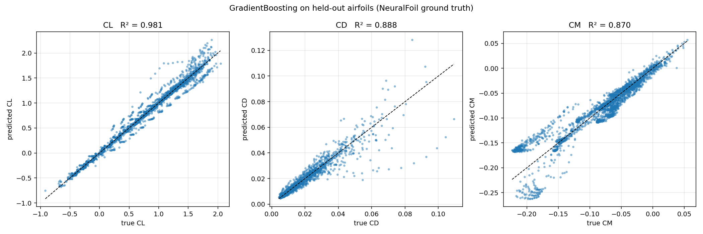
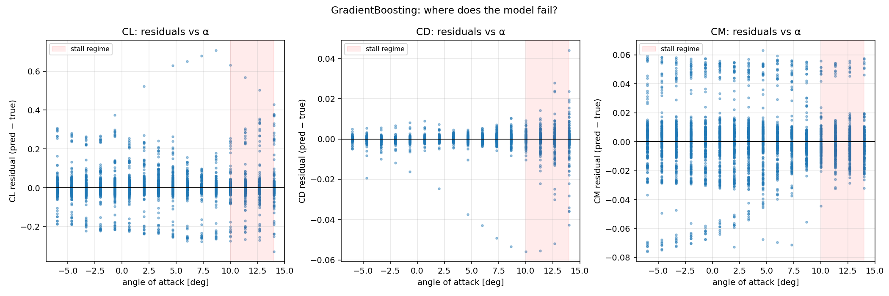
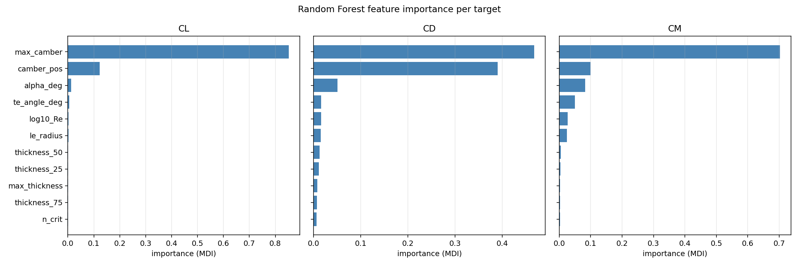
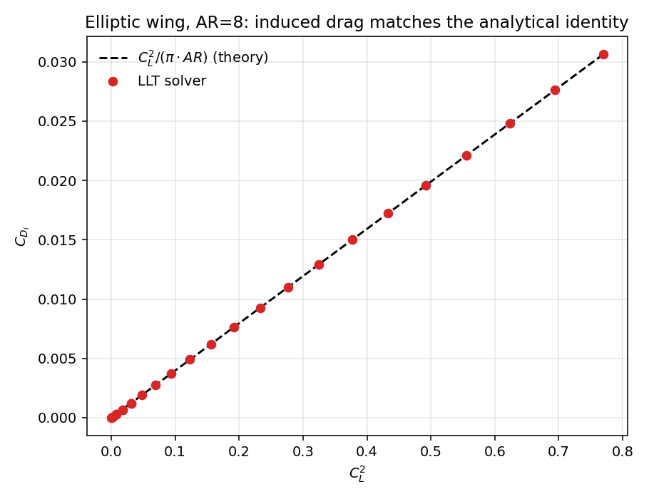
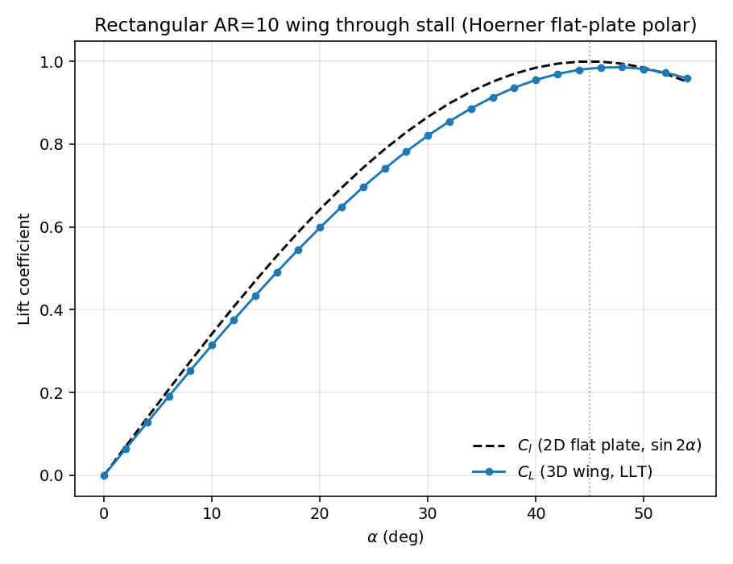
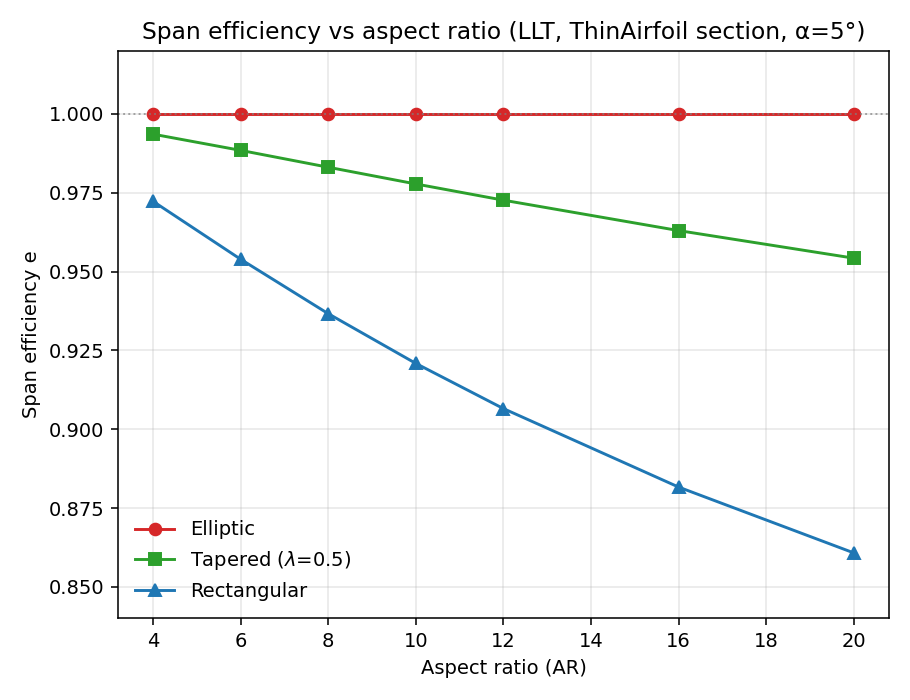

# aerosurrogate

[](https://github.com/raahimnawaz/aerospace_project/actions/workflows/ci.yml)
[](LICENSE)
[](https://www.python.org/)

A reproducible benchmark for replacing expensive panel-method aerodynamic solvers with small sklearn models, judged honestly against the 100-year-old closed-form baseline that's already in every aerospace textbook — plus a nonlinear lifting-line solver that lifts the 2D sectional polars to 3D finite-wing predictions.

**Headline 2D result.** On lift coefficient prediction, gradient boosting matches thin airfoil theory in the linear regime (R² 0.952 vs 0.950), pulls ahead through pre-stall (R² 0.89 vs 0.80), and stays useful into stall where thin airfoil theory collapses to **R² = −1.77**.



**Headline 3D result.** The nonlinear lifting-line solver reproduces the analytical identity ``CDi = CL² / (π · AR)`` for an elliptic wing to **3 × 10⁻¹⁵ relative error** (machine precision), agrees with the classical Glauert Fourier-series formulation to 4-5 decimals on rectangular and tapered wings, and converges through stall in 2-4 Newton iterations. Coupling NeuralFoil as the sectional polar produces a viscous 3D wing analysis where **induced drag is 69% of total drag** at ``CL = 0.5`` on a NACA 2412 AR=8 wing — exactly the contribution a 2D-only pipeline cannot see.



---

## What this is

An aerospace engineer designing a wing needs three numbers for every airfoil cross-section: lift coefficient $C_L$, drag coefficient $C_D$, and pitching-moment coefficient $C_M$. Computing them accurately means running XFOIL (panel + boundary-layer solver) or higher-fidelity CFD — seconds to hours per query. In a design loop iterating across thousands of airfoils × dozens of flight conditions, that cost is the bottleneck.

**The question this benchmark answers:** how close can a cheap regression get to a panel-method solver, and *where exactly does the cheap model break* compared to the classical closed-form theory?

## Headline numbers

Dataset: **15,334 samples** from **107 airfoils** (parametric NACA 4-digit sweep + curated UIUC database), labeled by NeuralFoil. Test set is **held-out entire airfoils** so accuracy measures generalization to unseen geometries, not interpolation between known points.

### CL — lift coefficient (with closed-form baseline)

| Model | CV R² | Test R² | Test MAE |
|---|---:|---:|---:|
| **Poly-2 Ridge** | 0.989 | **0.986** | 0.055 |
| GradientBoosting | 0.998 | 0.981 | 0.046 |
| RandomForest | 0.998 | 0.978 | 0.049 |
| Linear (Ridge) | 0.968 | 0.960 | 0.092 |
| Thin Airfoil Theory | — | 0.910 | 0.117 |

### CL by flight regime (the differentiator)

| Regime | α band | TAT R² | TAT MAE | GBM R² | GBM MAE |
|---|---|---:|---:|---:|---:|
| Linear | [−4°, +4°) | **0.950** | 0.058 | 0.952 | **0.046** |
| Pre-stall | [+4°, +10°) | 0.800 | 0.080 | **0.890** | **0.042** |
| Stall | [+10°, +14°] | **−1.766** | 0.282 | **0.769** | **0.052** |
| Negative | [−6°, −4°) | 0.888 | 0.066 | **0.927** | **0.042** |

**Reading the table.** In the linear regime the textbook formula is essentially as good as a 600-tree gradient boosting machine — both hit R² ≈ 0.95. The ML model only earns its keep at higher angles of attack: through pre-stall it lifts R² from 0.80 → 0.89, and in stall (where TAT's potential-flow assumption fails completely and its R² goes *negative*) ML still maintains R² = 0.77. This is the textbook regime split — and the project makes the boundary explicit instead of hiding it under a single global R².

### CD and CM (ML only — TAT doesn't predict drag or moment)

| Target | Best model | Test R² | Test MAE |
|---|---|---:|---:|
| CD | GradientBoosting | 0.888 | 0.0016 |
| CM | GradientBoosting | 0.870 | 0.013 |

Feature-importance highlights: CD is dominated by `α` (47%) and `log₁₀(Re)` (39%) — viscous regime matters. CM is dominated by `max_camber` (70%) — physically correct, since camber sets the moment.

---

## The math

**Thin airfoil theory** (Glauert, 1926) linearizes the potential-flow boundary value problem around a thin cambered plate. For a parabolic camber line $z(x) = 4m\,x(1-x)$ the integral collapses to

$$
C_L = 2\pi\,(\alpha - \alpha_{L=0}), \qquad
\alpha_{L=0} \approx -2 \cdot \frac{m}{c} \quad [\text{rad}]
$$

It has **zero learned parameters** — just $\pi$, $\alpha$, and camber. Comparing ML models against it tells you two things: where ML actually buys something (capacity to model viscosity, separation, thickness effects), and where it doesn't (small-α linear regime, where classical theory is already within a few percent).

The lift-curve slope $\partial C_L / \partial \alpha = 2\pi$ /rad ≈ 0.110 /deg is one of the most-tested identities in aerodynamics. The empirical lift slope across all airfoils in our held-out set, fit linearly in $|\alpha| < 4°$, has **median 0.105 /deg** — consistent with theory to 5%.

---

## Method

### Data pipeline

| Stage | Detail |
|---|---|
| Shapes | Parametric NACA 4-digit (camber 0/2/4/6%, position, thickness 8/10/12/15/18/21%) + curated UIUC database (Selig, Eppler, Wortmann, AeroLab) — **107 airfoils total** |
| Conditions | α ∈ [−6°, +14°] × 16 points; Re ∈ [10⁵, 10⁷] × 5 points geomspaced; n_crit ∈ {5, 9} |
| Labels | [NeuralFoil](https://github.com/peterdsharpe/NeuralFoil) (MIT) — neural-net surrogate for XFOIL trained on millions of viscous panel-method solutions; rows with `analysis_confidence < 0.90` dropped |
| Featurization | 8 geometric features (max camber, camber position, max thickness, leading-edge radius, trailing-edge wedge angle, local thickness at 25/50/75% chord) + 3 flow features (α, log₁₀(Re), n_crit) |

### Splitting

`split_by_airfoil()` holds out **entire airfoil shapes** for the test set. A naïve row-level split would put α=5° of NACA 0012 in train and α=6° of the same airfoil in test — the model can "predict" by interpolating its own training trajectory. Splitting on shape forces real generalization across the wing-design loop's actual use case.

### Models

Four pipelines, monotonically increasing in capacity, plus the closed-form physics baseline.

| Model | Capacity |
|---|---|
| Thin Airfoil Theory | closed form, 0 learned params |
| Ridge (linear) | linear in 11 features |
| Poly-2 + Ridge | linear in (11 + ${11 \choose 2}$) interaction terms |
| Random Forest | 400 trees, default depth |
| Gradient Boosting | 600 trees, depth 4, lr 0.05 |

### Property tests (`tests/test_physics.py`)

Nine aerodynamics-grounded tests that double as a dataset sanity check:

- $C_L(\alpha=0, m=0) = 0$ — symmetric airfoils make no lift at zero α.
- $\partial C_L / \partial \alpha = 2\pi$ /rad — closed-form identity.
- Odd symmetry: $C_L(-\alpha) = -C_L(+\alpha)$ for symmetric airfoils.
- Empirical lift slope (NeuralFoil data) falls in [0.08, 0.13] /deg — actual 0.105.
- Symmetric airfoils have $|C_L| < 0.2$ at $|\alpha| \le 1.5°$ — actual mean 0.07.
- $C_D > 0$ for every row — no negative drag.
- Drag bucket: symmetric airfoils have minimum $C_D$ near $\alpha = 0$ — verified.

---

## Figures

### Predicted vs actual (held-out airfoils)


### Where does the model fail? (residuals vs α with stall band shaded)


### Feature importance (Random Forest MDI)


---

## 3D extension: nonlinear lifting-line theory

The 2D surrogate above predicts ``Cl(α, Re)``, ``Cd(α, Re)``, ``Cm(α, Re)`` for an *infinite-span* airfoil. A real wing has finite span, so the trailing vortex sheet rolls up into wingtip vortices, which tilt the local lift vector backward and produce **induced drag** — roughly 30-50% of total drag at cruise for a high-aspect-ratio wing.

The :mod:`aerosurrogate.lifting_line` subpackage closes that gap. It pairs any 2D sectional polar (thin-airfoil theory, the trained sklearn surrogate, or NeuralFoil itself) with the classical induced-downwash kernel of Prandtl, solved by Newton iteration in the modern style of Phillips & Snyder (2000):

$$
F_i(\Gamma) \equiv \Gamma_i - \tfrac{1}{2} V_\infty\, c_i\, C_l\!\left(\alpha_{\text{eff},i}(\Gamma),\, Re_i\right) = 0
$$

with the Jacobian $J_{ij} = \delta_{ij} + \tfrac{1}{2} c_i\, a_i\, W_{ij}$ where $a_i = dC_l/d\alpha$ comes from a one-sided finite difference on the sectional polar (so the solver works with any polar — even a black-box neural net) and $W_{ij}$ is the horseshoe-vortex induction matrix.

### Validation (17 property tests, all passing)

| Identity | Source | Result |
|---|---|---:|
| Elliptic wing: $C_{D_i} = C_L^2 / (\pi \cdot AR)$ | classical LLT | matches to **3 × 10⁻¹⁵** rel. error |
| **Glauert Fourier-series LLT (independent formulation)** | Glauert 1926, Anderson Ch. 5 | $C_L$, $C_{D_i}$ agree to **0.5%** across elliptic/rectangular/tapered wings |
| Elliptic via Glauert: higher modes $A_n$ for $n ≥ 3$ | classical LLT | vanish to machine precision ($|A_3/A_1| \sim 10^{-17}$) |
| Finite-wing slope: $a = 2\pi \cdot AR/(AR+2)$ | Helmbold | matches to **5 × 10⁻⁵** |
| Rectangular wing: $e \in (0.85, 1.0)$ | classical LLT | 0.86 (AR=20) — 0.97 (AR=4) |
| Elliptic loading shape $\Gamma(y) \propto \sqrt{1-(2y/b)^2}$ | classical LLT | matches to 5 × 10⁻³ |
| Convergence through stall (α=0 → 55°) | flat-plate polar | converges in 2-7 Newton iterations |
| Washout shifts loading inboard | aircraft design | tip $\Gamma$ reduced 53% with −3° washout |

The Glauert cross-validation is the strongest internal-consistency check: the Newton solver discretizes the wing as a horseshoe-vortex sheet and iterates to a self-consistent circulation; the Glauert solver expands the same circulation as a half-span Fourier sine series and solves a single linear system. Two mathematically distinct formulations of the same physics agreeing to 4-5 decimals means the kernel, the integration weights, and the boundary conditions are all internally consistent.

### Demo figures

| Figure | What it shows |
|---|---|
|  | **The headline.** NACA 2412 wing (AR=8, Re=3×10⁶) analyzed with NeuralFoil as the 2D sectional polar. Left panel: lift-slope reduction (2D CL reaches 1.6 at α=14°, 3D wing only 1.34). Right panel: drag polar — the 2D NeuralFoil curve is nearly vertical (profile drag only); 3D LLT picks up induced drag, which dominates at high CL. **At CL = 0.5, induced drag is 69% of total.** |
|  | Solver trace lies exactly on the analytical line $C_{D_i} = C_L^2/(\pi AR)$ for an elliptic wing — machine-precision agreement is the test of any LLT implementation. |
|  | Rectangular AR=10 wing through stall (Hoerner flat-plate sectional polar). Demonstrates the nonlinear solver gracefully handling post-stall, which the linear LLT cannot. |
|  | Span efficiency vs aspect ratio for three planforms. Reproduces the classical LLT result: elliptic wings have $e \approx 1$, rectangular wings fall to 0.86 at AR=20. |

### Quickstart

```python
import math
from aerosurrogate.lifting_line import Wing, ThinAirfoilSection, solve_lifting_line

# Elliptic wing, AR=8.  For an ellipse S = π b c_root / 4, so c_root = 4 b / (π AR).
span, AR = 10.0, 8.0
c_root = 4.0 * span / (math.pi * AR)
wing = Wing.elliptic(span=span, root_chord=c_root, n_sections=80)

res = solve_lifting_line(wing, alpha_deg=5.0, section=ThinAirfoilSection())
print(f"CL  = {res.CL:.4f}")
print(f"CDi = {res.CDi:.5f}  (theory: {res.CL**2 / (math.pi * wing.aspect_ratio):.5f})")
print(f"e   = {res.span_efficiency:.6f}")    # → 1.000000 for elliptic
```

For NeuralFoil-backed sections (requires `pip install -e ".[build]"`):

```python
from aerosurrogate.lifting_line import NeuralFoilSection, alpha_sweep
import numpy as np

section = NeuralFoilSection(airfoil_name="naca2412", model_size="medium")
out = alpha_sweep(wing, np.arange(-2, 16, 1.0), section, Re_ref=3e6)
# out["CL"], out["CDi"], out["CD_profile"], out["CD"], out["span_efficiency"], ...
```

Reproduce all three demo figures:

```bash
python scripts/llt_demo.py
```

---

## Repo layout

```
src/aerosurrogate/
├── airfoils.py     UIUC + parametric NACA loaders (lazy aerosandbox import)
├── features.py     geometric feature extraction
├── dataset.py      build_dataset, load_dataset, split_by_airfoil
├── models.py       four sklearn pipelines
├── physics.py      thin airfoil theory baselines + Glauert α_{L=0}
├── eval.py         per-model + per-regime evaluation (with TAT comparison for CL)
├── plot.py         four figure generators
│
└── lifting_line/   nonlinear LLT solver — 3D finite-wing analysis
    ├── geometry.py     Wing dataclass (rectangular / elliptic / tapered factories)
    ├── sections.py     SectionalAero protocol + ThinAirfoil / FlatPlate / NeuralFoil
    ├── biot_savart.py  horseshoe-vortex downwash influence matrix
    ├── solver.py       Newton iteration + α-sweep with warm-start
    └── classical.py    Glauert Fourier-series LLT (independent cross-validation)

scripts/
├── build_dataset.py   rebuild data/aero_dataset.csv from scratch (needs neuralfoil)
├── train_eval.py      train every model, print headline + per-regime tables
├── make_figures.py    regenerate 2D figures/
└── llt_demo.py        regenerate the four LLT figures (incl. NeuralFoil-coupled)

tests/
├── test_physics.py        9 closed-form + empirical aerodynamics property tests
├── test_dataset.py        split-by-airfoil invariants + determinism
├── test_models.py         every pipeline fits + predicts on synthetic data
└── test_lifting_line.py   17 LLT validation tests: elliptic identity, Helmbold slope,
                           span-efficiency bounds, elliptic loading shape, washout,
                           post-stall convergence, Newton-vs-Glauert cross-validation
```

## Quickstart

```bash
git clone https://github.com/raahimnawaz/aerospace_project
cd aerospace_project
pip install -e ".[dev]"

pytest -q                          # 19 tests, ~3s on cached data
python scripts/train_eval.py       # reproduce every table in this README
python scripts/make_figures.py     # regenerate figures/
```

Rebuilding the dataset from scratch (slow, needs `aerosandbox` + `neuralfoil`):

```bash
pip install -e ".[build]"
python scripts/build_dataset.py
```

---

## What this benchmark does not claim

- **Does not beat NeuralFoil.** Our 2D labels *come from* NeuralFoil, so the surrogate's ceiling is NeuralFoil's accuracy. The benchmark is "how close can a 600-tree GBM get to NeuralFoil at much lower inference cost," not "we have a better airfoil solver." The lifting-line extension changes the framing: NeuralFoil is no longer the ceiling but the *sectional* input to a 3D wing solver, so the combined output now includes induced drag and stall behavior NeuralFoil alone cannot give.
- **Does not extrapolate.** Test set is held-out shapes within the same NACA + UIUC distribution. Generalization to wholly novel geometries (e.g. transonic airfoils, supercritical sections) is not measured here.
- **Planar, unswept wings only (3D extension).** The lifting-line solver assumes a planar wing with no sweep or dihedral. Adding swept / dihedral / multi-surface geometries means moving to a full vortex-lattice method (VLM); that's a deliberate future extension, not a current claim. The current scope is *exactly* the case where classical LLT gives the right answer.

The contribution is the **regime-aware benchmark methodology** + the explicit ML-vs-classical-theory comparison in 2D, *coupled with* a validated nonlinear 3D wing solver that closes the induced-drag gap.
